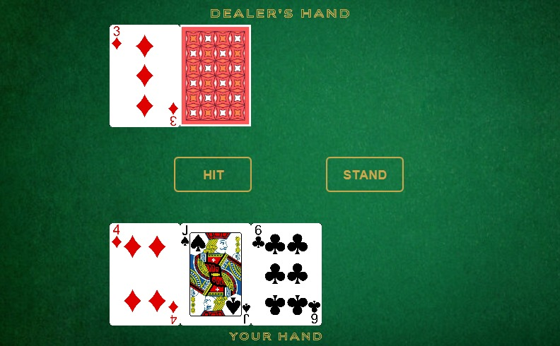

# Blackjack-Java
This is a simple Blackjack game implemented in Java with a graphical user interface (GUI) using JavaFX. The game allows users to play Blackjack against the computer, with standard rules of the game applied.

## Features
* Graphical User Interface (GUI): Built using JavaFX for a user-friendly experience.

* Game Logic: Standard Blackjack rules, including card dealing, hit, stand, and bust mechanics.

* Interactive Gameplay: Players can interact with the game using buttons to make choices like "Hit" or "Stand."

## Requirements
To run the game, you will need:

* Java Development Kit (JDK) 11 or higher

* JavaFX SDK

## Screenshots  
  
  
  
  
  
  
  

